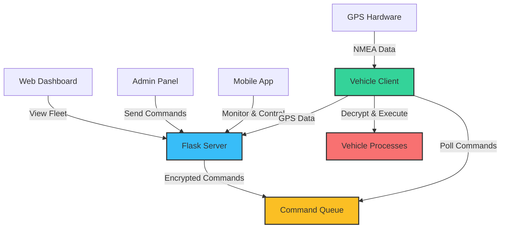

# 🚀 Secure Fleet Command & Control System

[](https://www.python.org/)
[](https://flutter.dev/)
[](https://flask.palletsprojects.com/)
[](LICENSE)

A **real-time monitoring and control system** for autonomous vehicle fleets with **end-to-end encrypted command transmission**, GPS tracking, and multi-platform support. Built for secure, scalable, and reliable remote vehicle management.


---

## 📋 Table of Contents

- [Overview](#-overview)
- [Key Features](#-key-features)
- [System Architecture](#-system-architecture)
- [Technology Stack](#-technology-stack)
- [Security](#-security)
- [Installation](#-installation)
- [Configuration](#-configuration)
- [Usage](#-usage)
- [API Documentation](#-api-documentation)
- [Flutter Mobile App](#-flutter-mobile-app)
- [Contributing](#-contributing)
- [Use Cases](#-use-cases)
- [Troubleshooting](#-troubleshooting)
- [License](#-license)

---

## 🎯 Overview

The **Secure Fleet Command & Control System** is a comprehensive solution designed for managing autonomous vehicles, drones, robots, or any remote IoT devices requiring secure command transmission and real-time monitoring.

### What Makes It Special?

✅ **End-to-End Encryption** - All commands encrypted with AES-256  
✅ **Real-Time GPS Tracking** - Live position updates with satellite imagery  
✅ **Multi-Platform Control** - Web dashboard + Flutter mobile app  
✅ **Scalable Architecture** - Easily expand to hundreds of vehicles  
✅ **Plug & Play** - Simple integration with existing systems  
✅ **Secure Authentication** - Session-based admin access

---

## ✨ Key Features

### 🔐 Security First
- **AES-256 Encryption** for all command payloads
- Encrypted vehicle ID, path, and action transmission
- Hardened against man-in-the-middle attacks
- Session-based authentication for admin panel

### 📡 Real-Time Monitoring
- **Live GPS tracking** with 5Hz update rate
- Satellite imagery view (Esri World Imagery)
- Real-time vehicle status (Running/Stopped)
- Active path visualization
- Custom vehicle markers with labels

### 🎮 Remote Control
- **Start/Stop** vehicles remotely
- Assign custom navigation paths
- Queue commands for offline vehicles
- Instant command execution via polling

### 📱 Multi-Platform Access
- **Web Dashboard** - Real-time fleet monitoring
- **Admin Panel** - Secure vehicle control interface
- **Flutter Mobile App** - iOS & Android support
- **REST API** - Integration with third-party systems

### 🚗 Vehicle Client Features
- Automatic GPS data transmission
- Command polling and execution
- Process lifecycle management
- Serial GPS integration (NMEA parsing)
- Fallback positioning

---

## 🏗 System Architecture



### Components

| Component | Purpose | Technology |
|-----------|---------|------------|
| **Flask Server** | Central command hub | Python, Flask |
| **Web Dashboard** | Public fleet monitoring | HTML5, Leaflet.js |
| **Admin Panel** | Secure vehicle control | Flask templates |
| **Vehicle Client** | On-board GPS & command execution | Python, pySerial |
| **Mobile App** | Cross-platform control | Flutter, Dart |
| **Crypto Module** | Command encryption/decryption | PyCryptodome (AES-256) |

---

## 🛠 Technology Stack

### Backend
- **Flask 3.0** - Lightweight web framework
- **PyCryptodome** - AES-256 encryption
- **pySerial** - GPS hardware communication
- **Requests** - HTTP client for vehicle updates

### Frontend
- **Leaflet.js** - Interactive mapping
- **Esri World Imagery** - Satellite tiles
- **Vanilla JavaScript** - Real-time updates (300ms polling)
- **Responsive CSS** - Mobile-friendly design

### Mobile
- **Flutter** - Cross-platform framework
- **flutter_map** - Map visualization
- **http** - API communication
- **Google Fonts** - Modern typography

### Encryption
- **AES-256-CBC** - Symmetric encryption
- **Base64 Encoding** - Payload transmission
- **Custom Protocol** - `acsno|path|action|script`

---

## 🔒 Security

### Encryption Details

All commands are encrypted using **AES-256 in CBC mode** before transmission:

```
Plaintext:  ACS01|Path-A|start|executor.py
              ↓
          AES-256 Encrypt
              ↓
Ciphertext: dmFsaWRfYmFzZTY0X2VuY29kZWRfZGF0YQ==
```

> ⚠️ **IMPORTANT**: The default encryption keys in `crypto.py` are for **demonstration only**. 
> **Replace them with secure, randomly generated keys before production deployment.**

### Best Practices for Production

1. **Key Management**
   - Use environment variables for keys
   - Implement key rotation policies
   - Store keys in secure vaults (e.g., HashiCorp Vault, AWS KMS)

2. **Authentication**
   - Replace hardcoded credentials with database authentication
   - Implement JWT tokens for session management
   - Add rate limiting to prevent brute force

3. **Network Security**
   - Deploy behind HTTPS/TLS
   - Use VPN for vehicle communication
   - Implement IP whitelisting

4. **Data Protection**
   - Sanitize all inputs
   - Implement CSRF protection
   - Enable SQL injection prevention

---

## 📦 Installation

### Prerequisites

- Python 3.8+
- pip package manager
- GPS hardware (optional, for vehicle clients)
- Flutter SDK 3.0+ (for mobile app)

### Server Setup

```bash
# Clone the repository
cd ACS_Sec

# Install dependencies
pip install -r requirements.txt

# Run the server
python app.py
```

The server will start on `http://0.0.0.0:5000`

### Vehicle Client Setup

```bash
# On each vehicle/device
cd ACS_Sec

# Install dependencies (if not already installed)
pip install -r requirements.txt

# Configure vehicle ID in vehicle_client.py
# Edit line 15: ACS_ID = "ACS01"  # Change to unique ID

# Configure server URL
# Edit line 14: SERVER_URL = "http://YOUR_SERVER_IP:5000"

# Run the client
python vehicle_client.py
```

### Flutter Mobile App Setup

```bash
cd flutter_app

# Install dependencies
flutter pub get

# Configure server URL in lib/main.dart
# Edit line 10: const String SERVER_URL = "http://YOUR_SERVER_IP:5000";

# Run on device/emulator
flutter run
```

---

## ⚙️ Configuration

### Server Configuration (`app.py`)

```python
# Default vehicles (update coordinates as needed)
CARS = {
    "ACS01": {"lat": 17.601838, "lon": 78.126866, "status": "Stopped", "path": "Path-A"},
    "ACS02": {"lat": 17.601938, "lon": 78.126966, "status": "Stopped", "path": "Path-B"},
    "ACS03": {"lat": 17.601738, "lon": 78.126766, "status": "Stopped", "path": "Path-C"},
}

# Admin credentials (CHANGE THESE!)
USERNAME = "admin"
PASSWORD = "admin123"  # Use strong password + hashing in production
```

### Vehicle Client Configuration (`vehicle_client.py`)

```python
# Server connection
SERVER_URL = "http://192.168.1.100:5000"  # Update to your server IP

# Unique vehicle identifier
ACS_ID = "ACS01"  # Must match a key in server's CARS dictionary

# GPS hardware settings (if using physical GPS)
GPS_PORT = "/dev/ttyACM0"      # Serial port for GPS
GPS_BAUDRATE = 38400            # Baud rate
GPS_TIMEOUT = 1                 # Read timeout in seconds
```

### Encryption Keys (`crypto.py`)

> ⚠️ **CRITICAL**: Replace these before production!

```python
# Generate secure 32-byte key for AES-256
SECRET_KEY = os.urandom(32)

# Generate secure 16-byte IV
IV = os.urandom(16)
```

---

## 🚀 Usage

### 1. Access the Web Dashboard

Navigate to `http://YOUR_SERVER_IP:5000`

- View **live fleet status** on satellite map
- See only **running vehicles** (stopped vehicles hidden)
- Monitor GPS coordinates, status, and active paths

### 2. Admin Panel Login

Navigate to `http://YOUR_SERVER_IP:5000/login`

**Default Credentials:**
- Username: `admin`
- Password: `admin123`

> ⚠️ **Change these immediately in production!**

### 3. Control Vehicles

From the admin panel:

1. **Select a vehicle** (ACS01, ACS02, ACS03)
2. **Choose a path** from dropdown
3. **Click START** to begin autonomous operation
4. **Click STOP** to halt the vehicle

Commands are encrypted and queued for the vehicle to fetch.

### 4. Mobile App Usage

1. Launch the Flutter app
2. Login with admin credentials
3. **Select vehicle** from dropdown
4. **Choose path** (Path-A, Path-B, etc.)
5. Tap **START** or **STOP** buttons
6. View real-time GPS updates on map

---

## 📡 API Documentation

### Public Endpoints

#### `GET /api/data`
Get all vehicle data (no authentication required)

**Response:**
```json
{
  "ACS01": {
    "lat": 17.601838,
    "lon": 78.126866,
    "status": "Running",
    "path": "Path-A"
  }
}
```

---

### Admin Endpoints (Require Login)

#### `POST /api/control`
Send encrypted command to vehicle

**Request:**
```json
{
  "acs_id": "ACS01",
  "action": "start",
  "path": "Path-A"
}
```

**Response:**
```json
{
  "status": "success",
  "car_status": "Running",
  "encrypted_payload": "base64_encrypted_string...",
  "decrypted_log": {
    "raw_command": "Command Queued for Vehicle Fetch"
  }
}
```

---

### Vehicle Client Endpoints

#### `POST /api/vehicle/update`
Update vehicle GPS position

**Request:**
```json
{
  "acs_id": "ACS01",
  "lat": 17.601838,
  "lon": 78.126866,
  "status": "Running",
  "path": "Path-A"
}
```

#### `GET /api/vehicle/command/<acs_id>`
Poll for pending commands

**Response:**
```json
{
  "command": "encrypted_base64_string"
}
```

---

## 📱 Flutter Mobile App

### Features

✅ **Dark Mode UI** with modern design  
✅ **Live Map** with OpenStreetMap tiles  
✅ **Vehicle Markers** with real-time updates  
✅ **Control Panel** for start/stop commands  
✅ **Path Selection** dropdown  
✅ **Status Cards** showing all vehicles  

### Screenshots

> *Add screenshots of your mobile app here*

### Building for Production

```bash
# Android
flutter build apk --release

# iOS
flutter build ios --release
```

---

## 🤝 Contributing

Contributions are welcome! Please follow these steps:

1. Fork the repository
2. Create a feature branch (`git checkout -b feature/amazing-feature`)
3. Commit your changes (`git commit -m 'Add amazing feature'`)
4. Push to the branch (`git push origin feature/amazing-feature`)
5. Open a Pull Request

### Guidelines

- Follow PEP 8 for Python code
- Use meaningful commit messages
- Add tests for new features
- Update documentation as needed

---

## 💡 Use Cases

This system is ideal for:

### 🚗 Autonomous Vehicles
- Fleet management for self-driving cars
- Delivery robots coordination
- Warehouse automation systems

### 🚁 Drone Operations
- Aerial surveillance fleets
- Delivery drone networks
- Agricultural monitoring swarms

### 🤖 Robotics
- Industrial robot coordination
- Service robot management
- Research robotics platforms

### 🏭 IoT Devices
- Remote sensor networks
- Smart city infrastructure
- Environmental monitoring systems

### 🎓 Research & Education
- Autonomous systems testing
- Multi-agent coordination research
- Cybersecurity training platforms

---

## 🔧 Troubleshooting

### Server Issues

**Problem**: Server won't start
```bash
# Check if port 5000 is already in use
sudo lsof -i :5000

# Kill existing process
sudo kill -9 <PID>

# Or run on different port
flask run --port 8080
```

**Problem**: GPS data not updating
- Verify vehicle client is running
- Check `SERVER_URL` matches actual server IP
- Ensure firewall allows port 5000

### Vehicle Client Issues

**Problem**: Cannot connect to GPS
```python
# Check available serial ports
python -m serial.tools.list_ports

# Update GPS_PORT in vehicle_client.py
```

**Problem**: Commands not executing
- Verify `ACS_ID` matches server configuration
- Check encryption keys match between server and client
- Ensure `decrypt_execute` function is working

### Mobile App Issues

**Problem**: Cannot connect to server
- Verify `SERVER_URL` in `main.dart`
- Ensure server is accessible from mobile device
- Check network firewall settings

---

## 📄 License

This project is licensed under the **MIT License** - see the [LICENSE](LICENSE) file for details.

---

## 🙏 Acknowledgments

- **Leaflet.js** - Interactive mapping library
- **Esri** - Satellite imagery tiles
- **Flask** - Python web framework
- **Flutter** - Cross-platform mobile framework
- **PyCryptodome** - Cryptography library

---

## 📞 Support

For issues, questions, or contributions:

- 🐛 **Report bugs**: [Open an issue](../../issues)
- 💬 **Discussions**: [Start a discussion](../../discussions)
- 📧 **Contact**: Create an issue for general inquiries

---

## 🔮 Future Enhancements

- [ ] Database integration (PostgreSQL/MongoDB)
- [ ] Historical path playback
- [ ] Geofencing and alerts
- [ ] Multi-user role management
- [ ] Telemetry data logging
- [ ] WebSocket for real-time updates
- [ ] RSA public key infrastructure
- [ ] Vehicle health monitoring
- [ ] Route optimization algorithms
- [ ] Emergency stop broadcast

---

**Made with ❤️ for autonomous systems enthusiasts worldwide**

*Star ⭐ this repository if you find it useful!*
